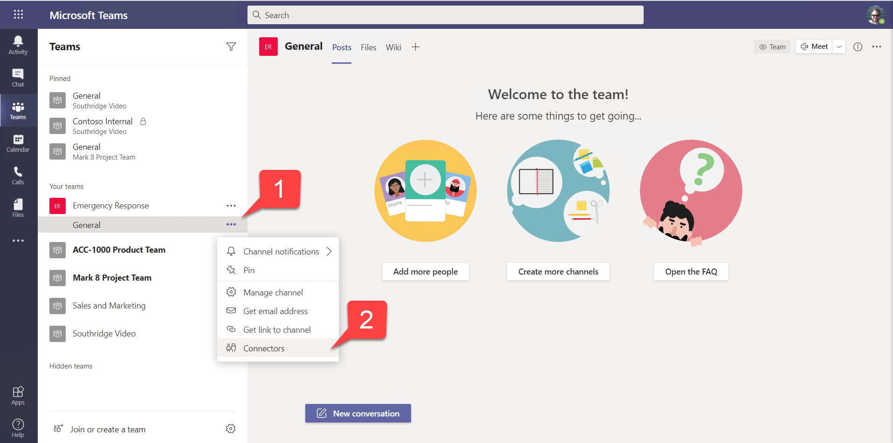
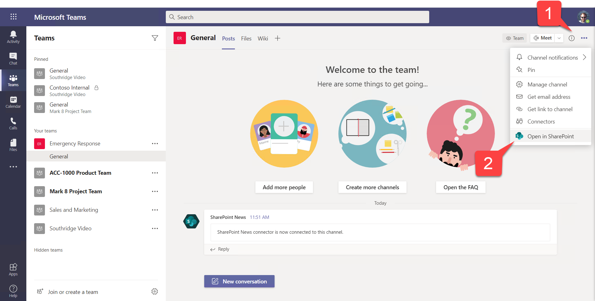
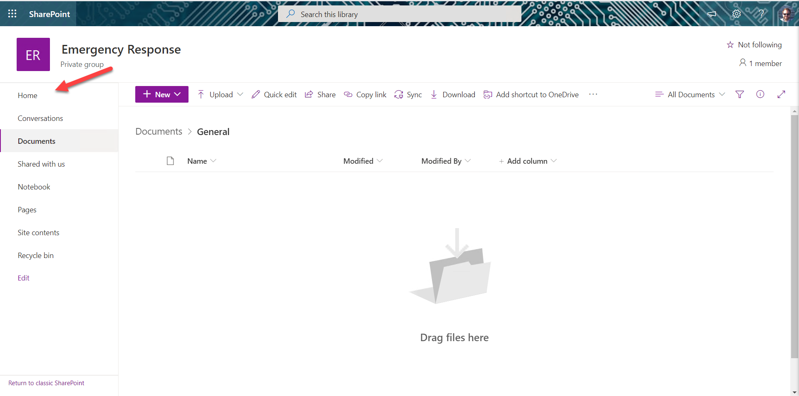
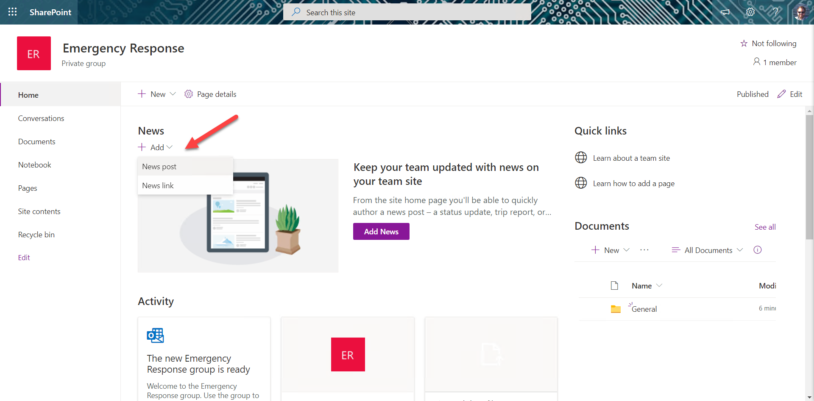
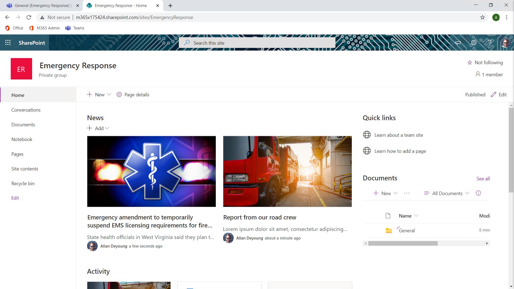
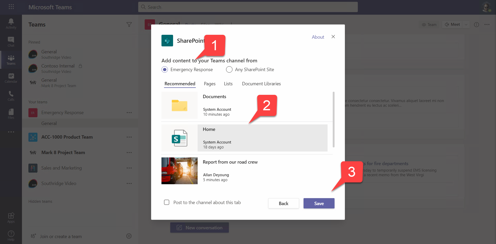
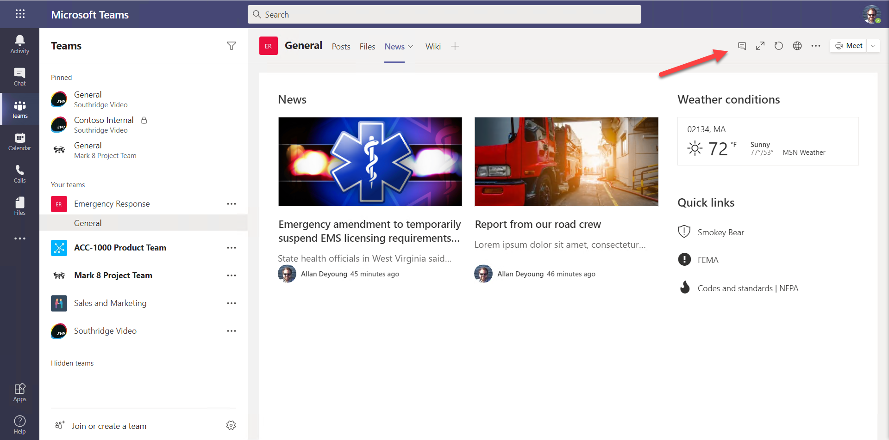

# Part 2: SharePoint News

 * [Exercise 1: Lab setup](Part1.md)
 * [Exercise 2: SharePoint News](Part2.md) **(You are here)**
 * [Exercise 3: SharePoint List Tab](Part3.md)
 * [Exercise 4: SharePoint Framework tabs](Part4.md)
 * [Exercise 5: Calling the Microsoft Graph](Part5.md)
 * [Challenges: Ideas for going beyond the lab exercises](Challenges.md)
 * [Resources](Resources.md)

In this exercise, you will create a news site in SharePoint and connect it to the Emergency Response team you set up in Part 1. This exercise is optional - the remaining parts do not depend on it - so you could choose to skip it or come back to it later, and proceed directly to [Part 3](Part3.md)

## Step 1: Add the SharePoint connector

To the right of the General channel, click the elipsis 1️⃣ to open the context menu, and select Connectors 2️⃣.

Find the SharePoint News connector; you may need to search 1️⃣. Click Add 2️⃣ to add the connector.

Click Add in the screen which follows, and then Save in the screen after that to save the connector. (NOTE: That last screen with the Save button is from SharePoint, not Teams; this is where Teams applications have a chance to configure their connector. In this case, SharePoint didn't require any configuration.)

## Step 2: Add some news to the SharePoint site

Still in the General channel, click the elipsis in the upper right corner 1️⃣ to open the menu and select "Open in SharePoint" 2️⃣. 

This will bring you into the SharePoint site that's associated with this Team, viewing the file folder for the channel. Navigate to the Home page.

On the home page under News, click Add. Add one News Post and one News Link.

When you create the News Post, search for a stock image that conveys an emergency. For the News Link, search the Internet for a news story about an emergency and paste the URL.

## Step 3: Add a News tab to the General channel
Return to the General channel in Microsoft Teams. To the right of the tabs, click "+" to add a tab to the channel.

Find the SharePoint tab and add it to the channel.

Be sure you select the default SharePoint site 1️⃣ and click the Home page 2️⃣ to select it. Click Save 3️⃣ and view your news page.

Rename the tab "News" and drag it to the left of the wiki tab.

##

When you're ready, please [proceed to the next section.](Part3.md)

## Challenges

 * In the News tab, click the Conversation button and start a conversation about the news

 * Add useful links and other content to the home page