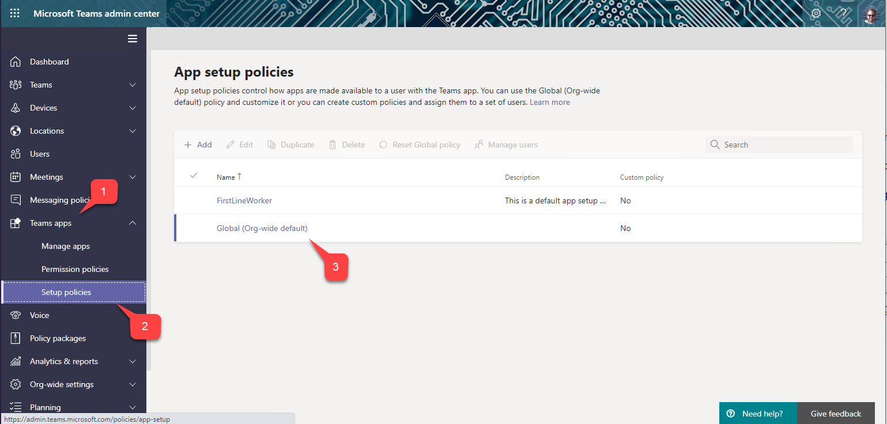
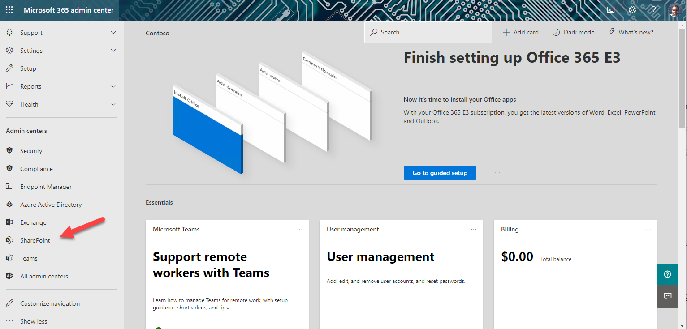
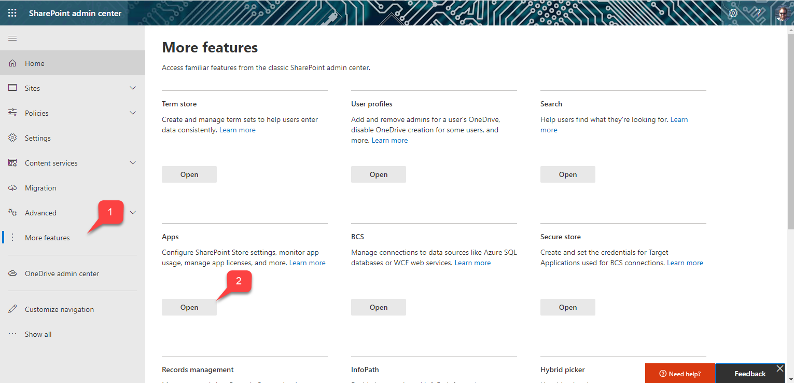
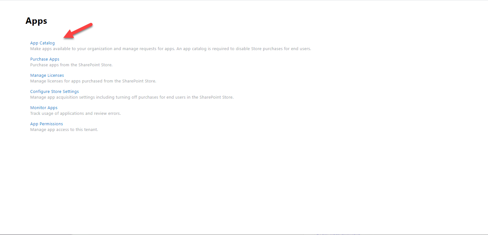
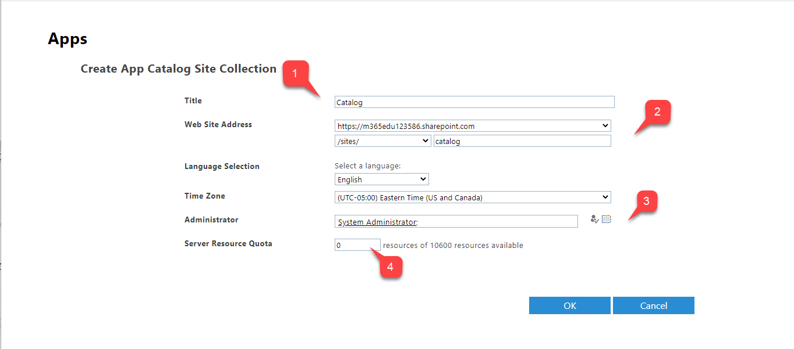
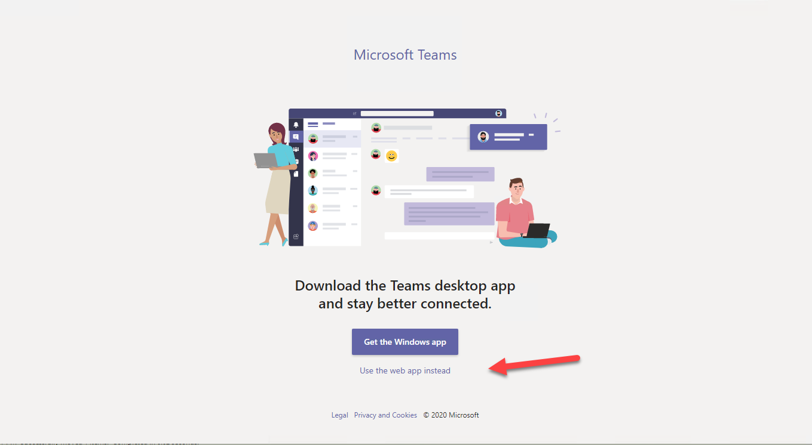
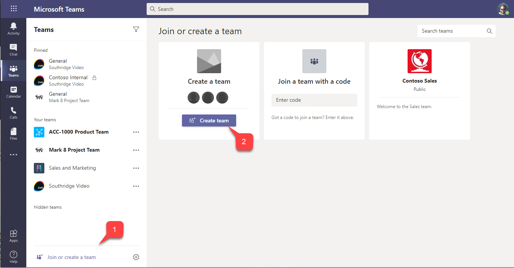
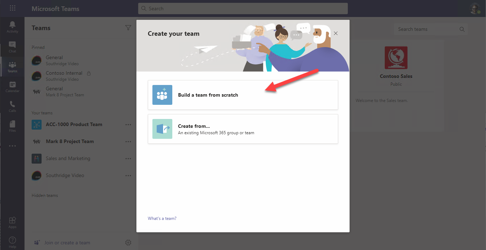
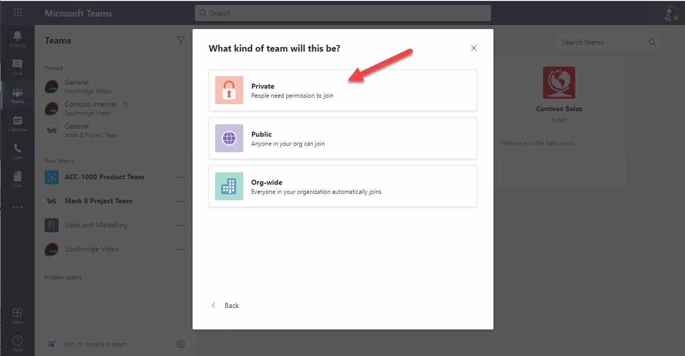
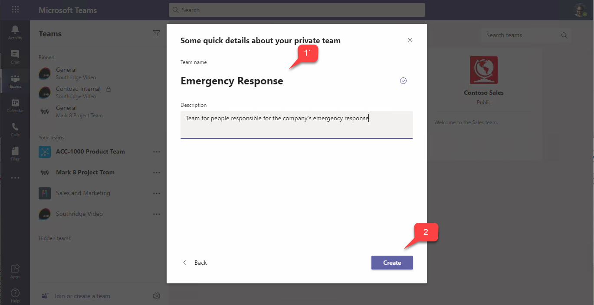

# Exercise 1: Lab Setup

 * [Presentation](../Presentation.md)
 * [Exercise 1: Lab setup](Part1.md) **(You are here)**
 * [Exercise 2: SharePoint News](Part2.md)
 * [Exercise 3: SharePoint List Tab](Part3.md)
 * [Exercise 4: SharePoint Framework tabs](Part4.md)
 * [Exercise 5: Calling the Microsoft Graph](Part5.md)
 * [Resources](Resources.md)

In this section, you'll set up your tenant for SharePoint and Teams development.

## Step 1: Get a tenant

If you don't yet have a tenant, ask the workshop leader or join the [Microsoft 365 Developer Program](https://developer.microsoft.com/microsoft-365/dev-program?WT.mc_id=M365-github-rogerman) to get a free one. Your tenant includes 25 [E5 user licenses](https://www.microsoft.com/microsoft-365/enterprise/compare-office-365-plans?WT.mc_id=M365-github-rogerman) and can be renewed as long as you keep developing!

Go to the [Microsoft 365 admin center](https://portal.office.com/AdminPortal/Home#/homepage) and log in as an administrator of your new tenant.

---
😎 DON'T DEVELOP IN PRODUCTION: It may be tempting to build solutions right where you work every day, but there are good reasons to have a dedicated dev tenant - and probably additional staging/test tenants. They're free, and you can safely experiment as a tenant admin without risking your production work. 

---
😎 NAVIGATING MANY TENANTS: Consider creating a browser profile for each tenant that will have its own favorites, stored credentials, and cookies so you can easily work in your development tenant(s) as well as your production environment.

---
😎 CHANGES ROLL OUT FIRST TO "TARGETED RELEASE" TENANTS. You may want to [enable Targeted Release](https://docs.microsoft.com/microsoft-365/admin/manage/release-options-in-office-365?WT.mc_id=M365-github-rogerman) in your developer tenant and keep production on Standard Release so you have a head start to test out new features.

---

## Step 2: Enable Teams application uploads

By default, end users can't upload Teams applications directly; instead an administrator needs to upload them into the enterprise app catalog. In this step you will enable direct uploads to make developement easier and allow installation directly from [App Studio](https://docs.microsoft.com/microsoftteams/platform/concepts/build-and-test/app-studio-overview?WT.mc_id=M365-github-rogerman) or the [Microsoft Teams Toolkit for Visual Studio Code](https://docs.microsoft.com/microsoftteams/platform/toolkit/visual-studio-code-overview?WT.mc_id=M365-github-rogerman).

  a. In the left panel of the admin center, click "Show all" to open up the entire navigation

  

  When the panel opens, click Teams to open the Microsoft Teams admin center.

  

  b. In the left of the Microsoft Teams admin center, open the Teams apps accordion 1️⃣ and select Setup Policies 2️⃣. You will see a list of App setup policies. Click the Global (Org-wide default) policy 3️⃣.

  

 c. Ensure the first switch, "Upload custom apps" is turned On.

 

 We have been working to get this enabled by default on developer tenants, so it may already be set for you. The change can take up to 24 hours to take effect, but usually it's much faster. Instructions for completing the labs without "Upload custom apps" are included, but it will be easier if it's turned on.

## Step 3: Create the SharePoint app catalog

This one can take up to 30 minutes to take effect, so again we want to get it done right away.

 a. Return to the Microsoft 365 admin center; this time click "SharePoint" to go to the SharePoint admin center.

 

 b. In the SharePoint admin center, click "More Features" 1️⃣ and then open the Apps page 2️⃣.

 

 c. In the Apps screen, click App Catalog

 

 Click OK to create a new app catalog site.

 

 On the Create App Catalog Site Collection screen,

  * 1️⃣ Set the title to "Catalog"
  * 2️⃣ Don't change the host name or managed path of the Web Site address, but do complete the address with "catalog"
  * 3️⃣ Make yourself the administrator of the app catalog by typing "Admin" and click the small person icon
  * 4️⃣ Server resource quota is obsolete; you can leave it or set it to zero

  Click OK to create the app catalog.

 

 d. You will be brought to the Classic sites view. You should see the app catalog site collection with a spinning green icon to indicate it's in the process of being created. When the green icon becomes the word "New", the app catalog site has been created.

 NOTE: The app catalog still won't work right away; you'll get errors if you try to upload an app right now. You might want to note the time; it can take up to 30 minutes. Meanwhile, you can proceed to the next part of the exercise; Part 2 does not require either the Teams upload or the SharePoint app catalog.

 ## Step 4: Create the Team

 a. Browse to [https://teams.microsoft.com](https://teams.microsoft.com) log in if you're prompted. These exercises assume you're using the web client, so click "Use the web client instead".

 

 b. Click "Join or create a team" to create your team 1️⃣; then click the "Create Team" button 2️⃣.

 

 c. Click "Build a team from scratch"

 

 d. Click "Private" so people not on the emergency response team can't join without permission.

 

 e. Name your Team "Emergency Response" 1️⃣ and click "Create" 2️⃣.

  

 You can skip adding members to the Team because there probably aren't any other users to add!

---
😎 TEST USERS: Always test your code with a non-admin user. Your tenant has 25 E5 licenses, use them to create various personas who have different permissions, and test with them!

 -----

 f. Click the Files tab in the General channel. You may get a message saying it's not ready yet; that's because the SharePoint site doesn't get provisioned until it's first used. You have just initiated the provisioning, and it will save you waiting a few minutes in the next exercise.

When you're ready, please [proceed to the next section.](Part2.md)