# Exercise 3: SharePoint List Tab

 * [Presentation](../Presentation.md)
 * [Exercise 1: Lab setup](Part1.md)
 * [Exercise 2: SharePoint News](Part2.md)
 * [Exercise 3: SharePoint List Tab](Part3.md) **(You are here)**
 * [Exercise 4: SharePoint Framework tabs](Part4.md)
 * [Exercise 5: Calling the Microsoft Graph](Part5.md)
 * [Resources](Resources.md)

In this exercise you'll create a Teams application for managing supply needs during an emergency. The app will be implemented as a SharePoint list, and published as a Teams tab.

## Step 1: Create the SharePoint list

a. In the General channel's Posts tab, click the elipsis in the upper right corner 1️⃣ and select "Open SharePoint" 2️⃣.

b. The SharePoint site should open in a new browser tab. In the left navigation, click "Site contents" 1️⃣. Click the drop-down on the New button 2️⃣ and select "List".

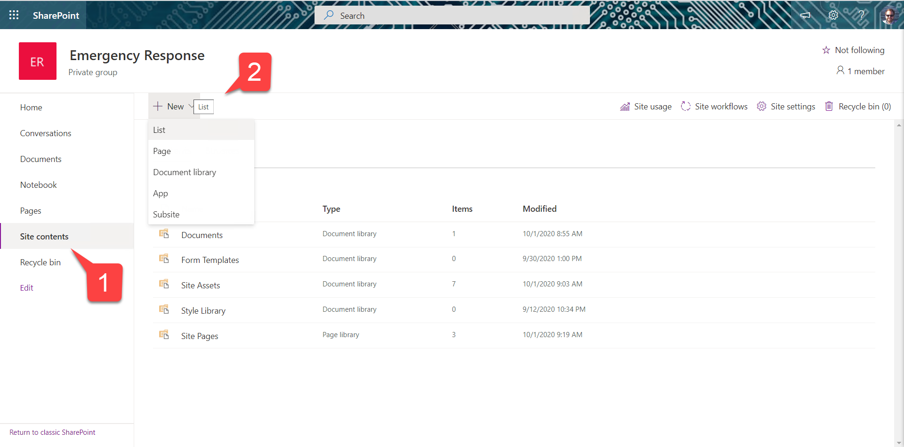

c. Name the list "Supplies Needed" 1️⃣ and then click the "Create" button 2️⃣.

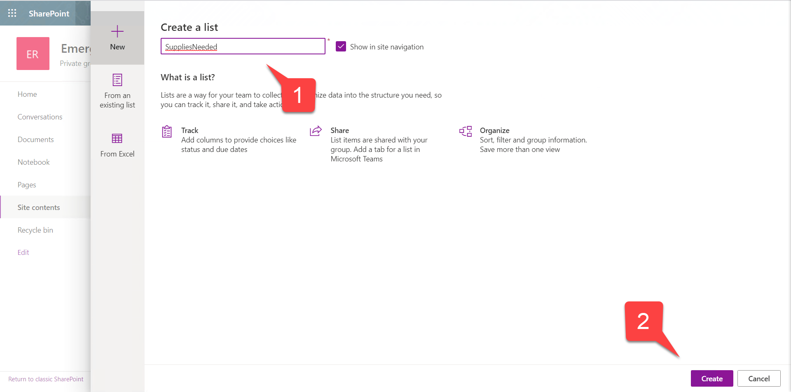

d. Click "Add Column" 1️⃣ and select a new "Location" column 2️⃣.

e. Name the column "Location" 1️⃣. Do not show any of the linked columns, just click "Save" 2️⃣.

f. Click the down arrow to the right of the new column name 1️⃣ to open a menu and select "Format this column" 2️⃣.

g. Under column formatting, paste in the JSON 1️⃣ from the [location.json](../Solution/Column%20samples/location.json) file in this project and click "Save" 2️⃣.

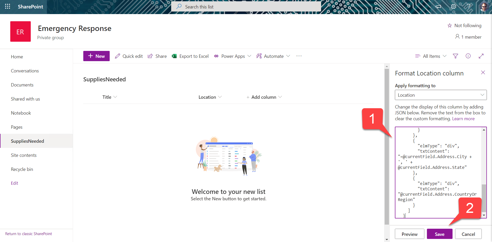

h. Repeat the process for additional columns as follows. Note that for some of the columns you'll need to click "Advanced mode" to get to the JSON. Also, when you're adding the choices to the Supplies column, pay attention to exact spelling and upper/lower case or the formatting won't work correctly.

| Column name | Column type | Formatting JSON |
|---|---|---|
| Contact | Person | [contact.json](../Solution/Column%20samples/contact.json) |
| Supplies | Choice of: Food, Water, Flashlight, Pet supplies, Medicine (Allow multiple selections, which is hidden under "more options") | [supplies.json](../Solution/Column%20samples/supplies.json) |
| Comments | Multi-line text | none |

i. Click the drop-down on any of the columns, under "Column settings" select "Show/Hide columns". De-select the Title column 1️⃣, and reorder the columns as you wish 2️⃣. Then click "Apply" 3️⃣ to update the default view of the list.

j. Enter some requests for supplies to the list as you wish.

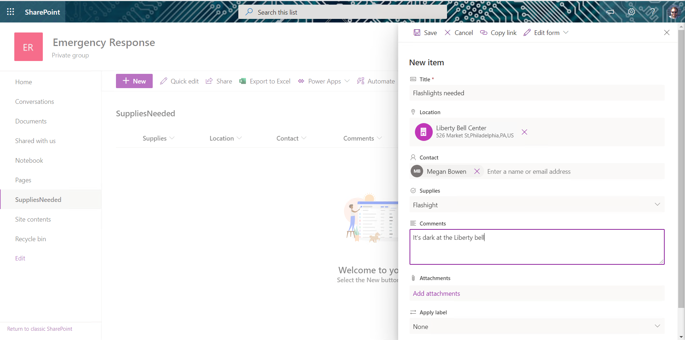

Your list should show the supply requests with special column formatting. Notice that you can click a contact name to open a Teams chat with the person.

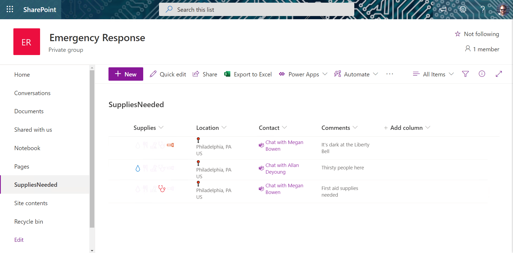

k. Save a copy of the list URL somewhere for use in a later step.

---
😎 CHOOSING A LIST LOCATION: We could've put the SharePoint list anywhere, but by creating it in the SharePoint site associated with the Team, we can be sure that anyone with permission to the Team can access it. It's also possible to go into SharePoint and open up the permissions if you wanted a particular list to be more widely available.

---

## Step 2: Add the list as a tab in your Team

In this step, you'll add the list you just created to the Emergency Response Team.

a. In the General channel, to the right of the other tabs, click the "+" to add a new tab. Find the "Lists" application and add it.

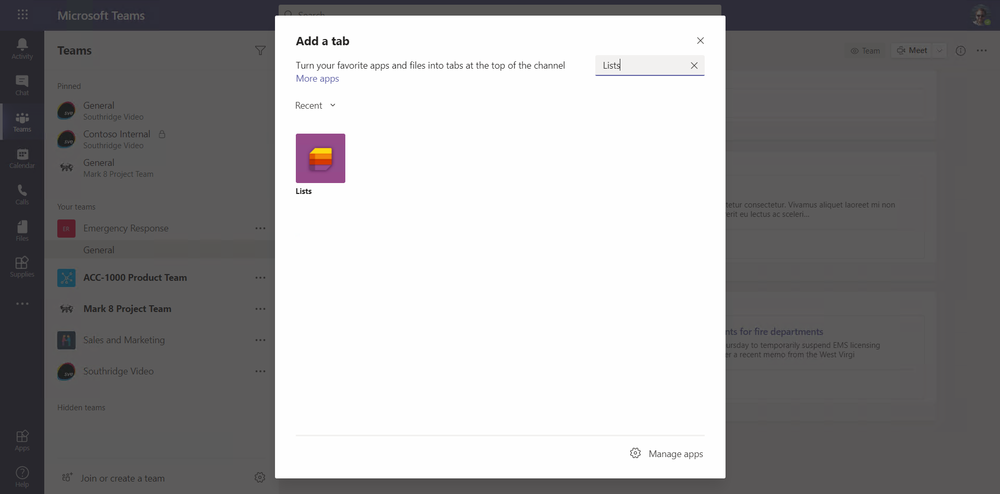

---
⛏️ [MICROSOFT LISTS](https://resources.techcommunity.microsoft.com/microsoft-lists/?WT.mc_id=M365-github-rogerman) is a new way to access SharePoint lists. SharePoint List features such as column formatting, managed metadata, lookup fields, etc. work normally. What's new is the ways to find and access the lists, including a new Lists mobile app. You can access the list data just as you would any SharePoint list: via the Graph API, Power Platform connectors, or SharePoint native APIs.

---

b. Click "Save" to save the tab.

c. Select "Add an existing list"

d. Select the list you created in Step 1.

e. Your list will be displayed as a tab. Feel free to rename the columns or drag them to change the order (though Posts and Files always need to come first).

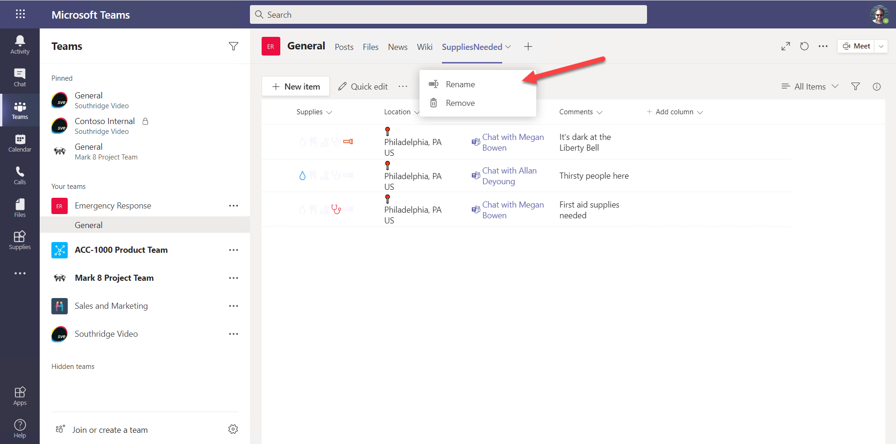

## Step 3 - Create a real Teams application using App Studio

In Step 2 you succeeded in making the list available to the Team, but you didn't actually create a Teams app, you used the Lists app. What if you wanted to make the supplies application available to people outside the Emergency Response Teams? What if you wanted to pin it to the left sidebar for the workers who should have it?

In this optional exercise, you'll do just that.

a. First, install App Studio from the Teams app catalog. In the left sidebar, click "Apps" 1️⃣, and then search for "App Studio" 2️⃣. Click on App Studio in the search results 3️⃣ to install it for yourself.

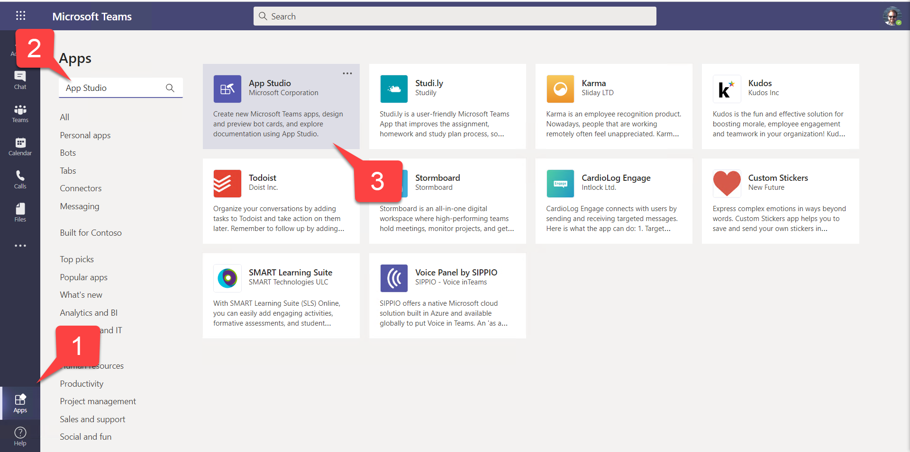

b. Go to the "Manifest editor" tab in App Studio 1️⃣ and create a new app 2️⃣.

c. Fill in the app details:

 * Give your app a short name and a full name
 * Press the "Generate" button to generate a unique ID for your app
 * Choose a unique package name. A good practice is to use a DNS domain name you own in the name to ensure uniqueness.
 * Enter short and long descriptions that will be displayed in the app's About tab
 * Enter the developer information that will be displayed in the app's About page. The website, privacy, and terms of use URLs must begin with https://.

Scroll down and upload icons for your app. You can get suitable icons in this repository in the [Solution/Column samples](../Solution/Column%20samples) directory. If you want an accent color that matches the icons, use #20007d.

d. Under "Complete these steps," click "Tabs" 1️⃣ and add a Personal tab 2️⃣. 

---
⛏️ WHY A PERSONAL TAB? Well, personal tabs can be pushed out to users and pinned to the Teams sidebar; you'll do that in the next step. 

In order to build an app with tabs that work in Teams channels and group conversations, you need to create a configuration page. There's a challenge at the end of this exercise if you want to give that a try!

---

Fill in the fields as follows (don't click "save" yet):

* Name: The default tab name (users can always be rename it)
* Entity ID: A unique identifier within your app. This can be used to pass context to your tab, but in this case we don't need that.
* Content URL: Paste in the list URL you saved in step 1k; you can remove everything after AllItems.aspx.
* Web URL: Paste in the list URL you saved in 1k, again removing anything after AllItems.aspx.

e. You need to modify the content URL before you're done, so if you saved the personal tab, open it back up for editing now. The content URL is the one displayed in the Teams app, and the web URL is only displayed if Teams needs to launch a seperate web browser. 

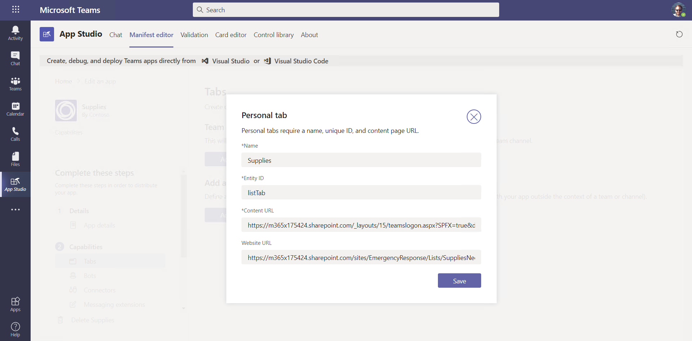

The problem is that the Teams app may sometimes fail to log into SharePoint, so we need to modify the content URL to force the login. (SharePoint veterans may appreciate that the tab will fail when SharePoint's FedAuth cookie expires ... remember the FedAuth cookie? It's still around!)

You need to insert `/_layouts/15/teamslogon.aspx?SPFX=true&dest=` into the URL right after the host name. So, for example, if your list URL is

~~~ text
https://m365x123456.sharepoint.com/sites/EmergencyResponse/Lists/SuppliesNeeded/AllItems.aspx
~~~

the content URL should be

~~~ text
https://m365x175424.sharepoint.com/_layouts/15/teamslogon.aspx?SPFX=true&dest=/sites/EmergencyResponse/Lists/SuppliesNeeded/AllItems.aspx
~~~

Now you can save your work.

---
⛏️ THIS FUNCTIONALITY IS IN PREVIEW and subject to change. [Details are in this article](https://docs.microsoft.com/en-us/sharepoint/dev/features/embed-pages-to-teams). 

---

f. Test your app by installing it for your own use. Under "Complete these steps" scroll down and select "Test and distribute" 1️⃣. Then click the "Install" button 2️⃣.

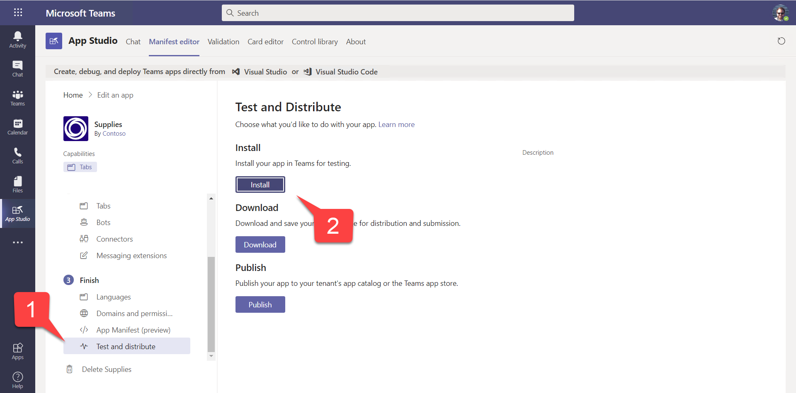

Notice that the information from your app manifest appears in the dialog box.

g. The app should open and you can view and edit the supplies list. If you right-click on the app in the sidebar 1️⃣ and click "Pin" 2️⃣, the app will stay on your sidebar. 

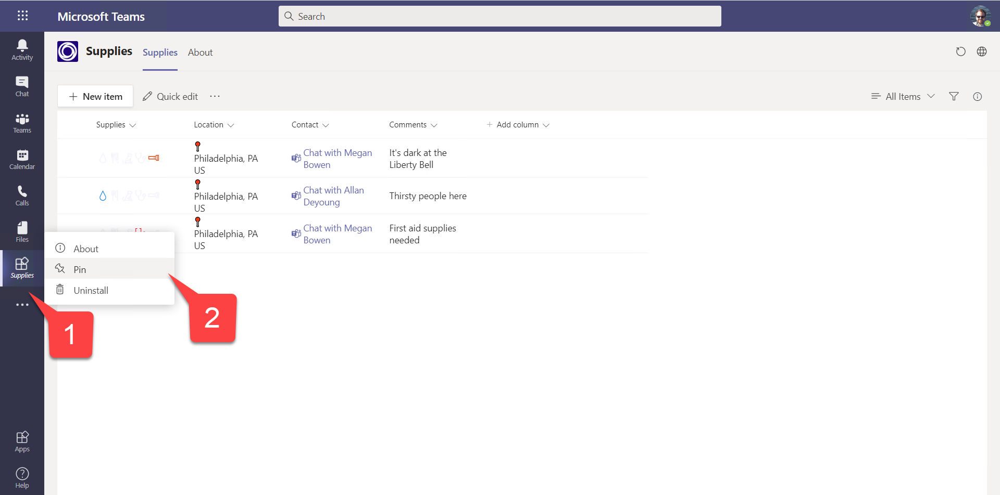

## Step 4: Install and pin the app using App Policies

a. Re-open App Studio, which will be under the elipsis in the Teams sidebar 1️⃣. Open the Manifest tab 2️⃣ and re-open the previously added Supplies app. Select the "Test and distribute" task 3️⃣. This time, click Download 4️⃣ and save a copy of the application package (.zip file) on your computer.

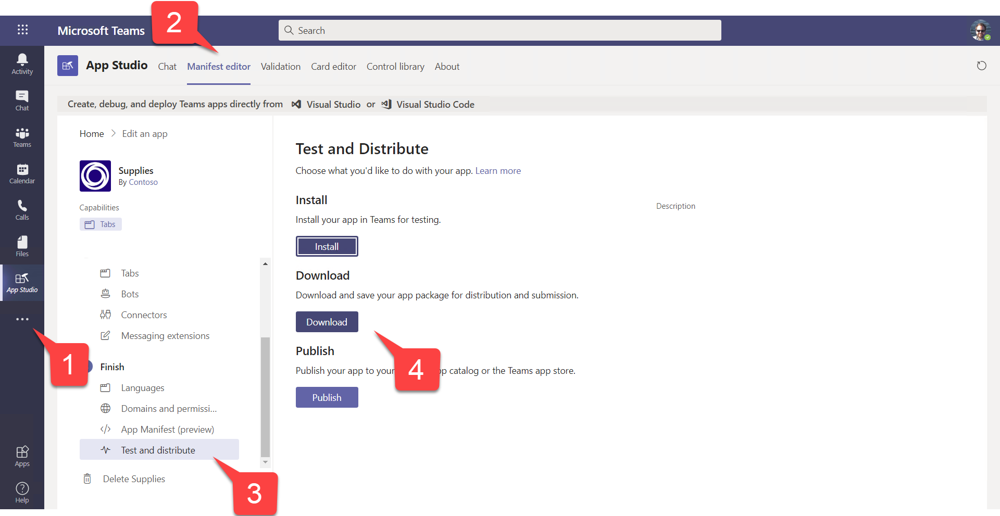

Take a moment to open the zip archive. You will find the two icons and a file called manifest.json, suitable for checking into your favorite source control system. All the information you entered in App Studio there.

b. Click Apps in the Teams sidebar 1️⃣, then click "Upload a custom app" 2️⃣. If you are a Teams administrator, you will see your tenant name as an option 3️⃣; select that to upload the app to your enterprise app catalog.

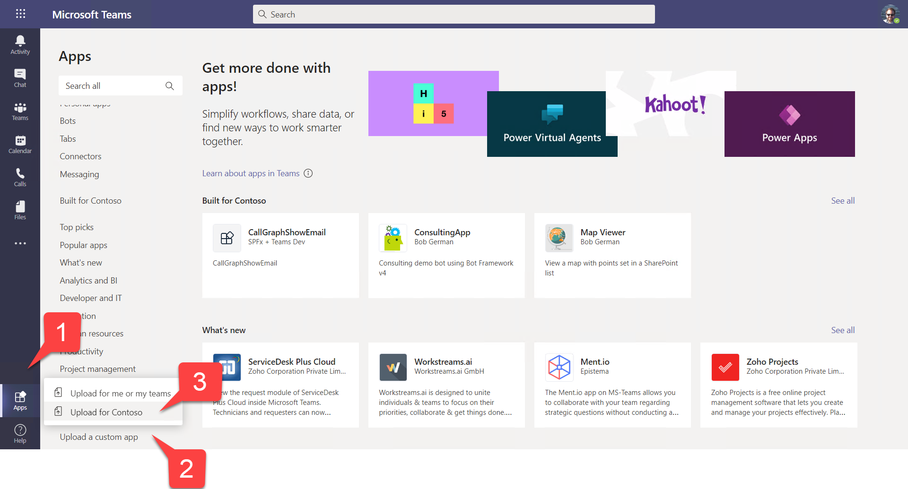

Now when you click the "Built for (tenant name)" link, your app will be listed. (You may just see the tenant name without "Built for".)

c. Open the [Teams admin site](https://admin.teams.microsoft.com/) and, under "Teams apps" 1️⃣ select "Setup policies" 2️⃣. Click the "+" 3️⃣ to add a new policy.

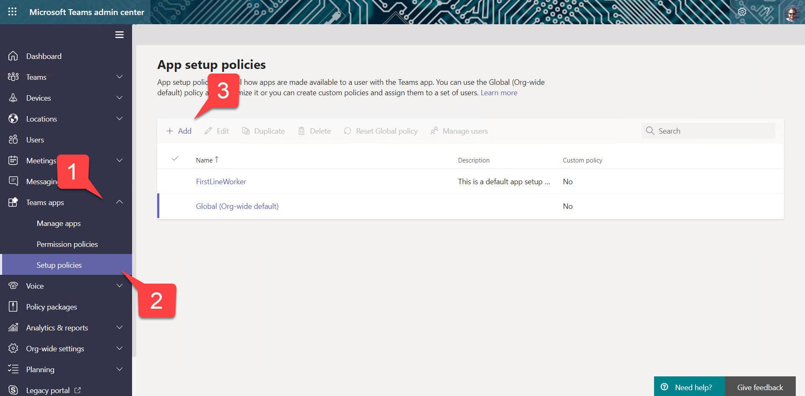

Give your policy a name 1️⃣ and click "Add apps" 2️⃣ to install an app for the users affected.

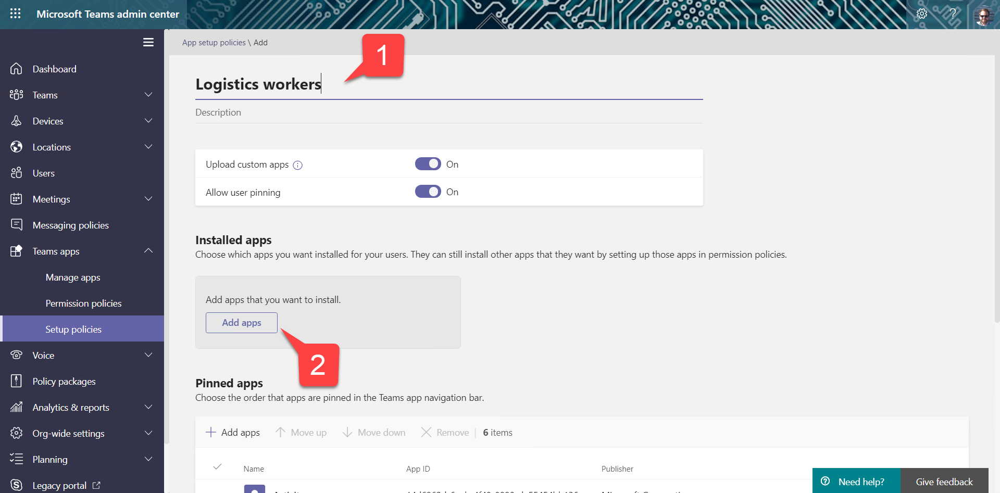

Search for the Supplies app 1️⃣ and click or hover over the name 2️⃣ when it pops up. This will make an "Add" button 3️⃣appear; click it 4️⃣. Back on the policy page, click "Save" to save your work.

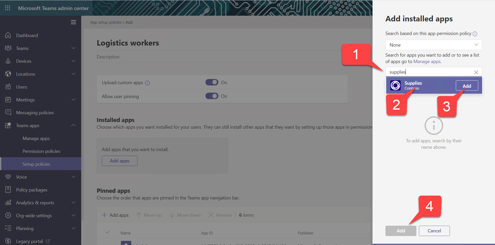

Now scroll down and add a pinned app. Same as before, add the Supplies app to pin it for all users affected by the policy. Scroll down and click Save to create the App Setup Policy.

d. Back at the list of setup policies, select the policy you just created and "Manage users" to select the users who the policy will apply to. It is currently only possible to add individual users and not Teams or groups. If you wish it worked for groups, please vote for [this UserVoice suggestion](https://microsoftteams.uservoice.com/forums/555103-public/suggestions/38130793-add-ability-to-assign-teams-apps-setup-policies).

It can take up to 24 hours for the app policy to take effect.

---
😎 [USER VOICE](https://microsoftteams.uservoice.com/forums/555103-public) is the place to ask for Teams features, or to see what features other people are requesting. Teams engineering really does listen, and may indicate their intent to implement a feature right there in User Voice. Another place to check is the [Microsoft 365 Roadmap](https://www.microsoft.com/microsoft-365/roadmap?filters=&WT.mc_id=M365-github-rogerman), which shows features that are coming soon.

---
🏁 CHALLENGE: Make your app work in a Teams channel rather than using the Lists app. This requires a configuration page that interacts with users when the tab is added. 

There's a SharePoint web part sample that can make any SharePoint page into a configuration page; [this article explains](https://bob1german.com/2020/01/07/teams-apps-with-sharepoint2/). For your convenience, the web part is already compiled and the SharePoint app package is [here in this repo](../Solution/MapViewerPackages/Exercise%203%20Challenge%20-%20Configurable%20Tab). The next exercise will teach you how to install it!

---

   
When you're ready, please [proceed to the next section.](Part4.md)

