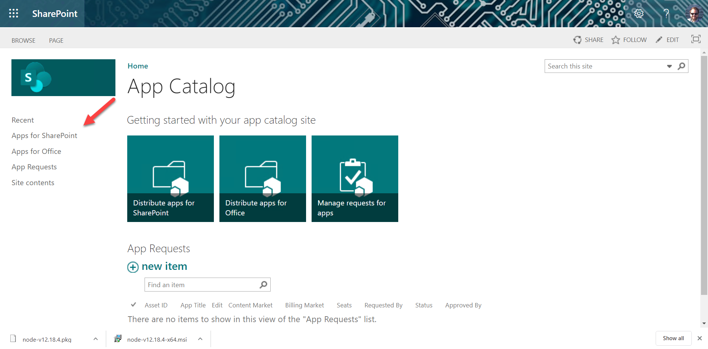
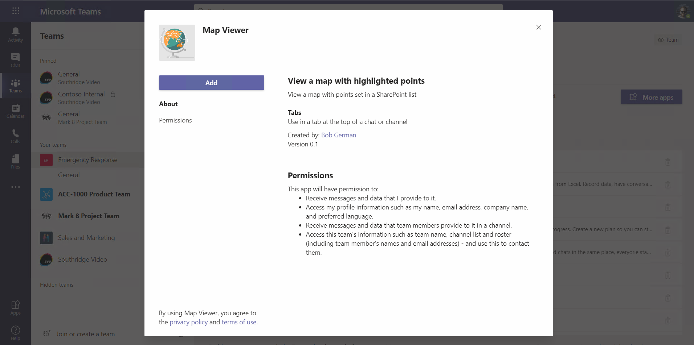
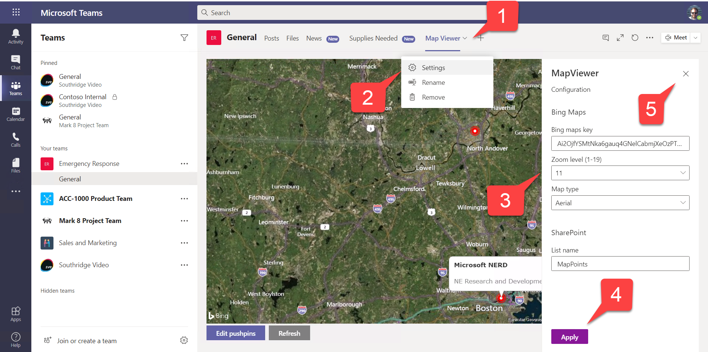
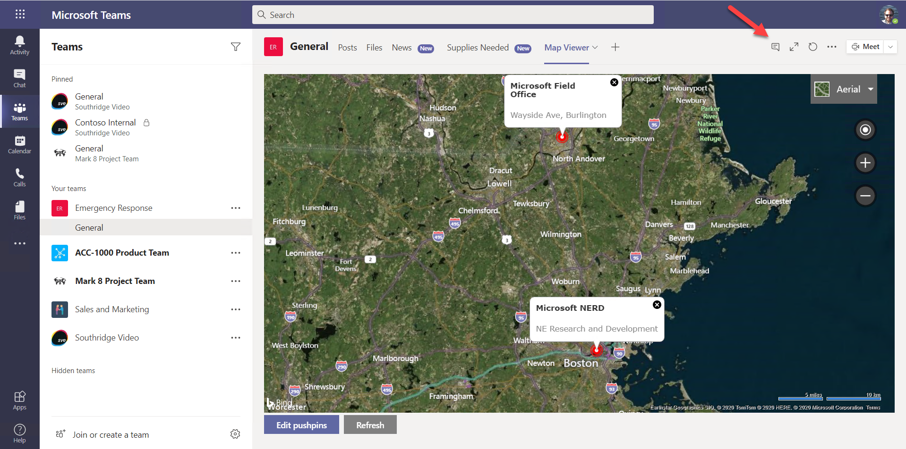

# Part 4: SharePoint Framework tabs

 * [Exercise 1: Lab setup](Part1.md)
 * [Exercise 2: SharePoint News](Part2.md)
 * [Exercise 3: SharePoint List Tab](Part3.md)
 * [Exercise 4: SharePoint Framework tabs](Part4.md) **(You are here)**
 * [Exercise 5: Calling the Microsoft Graph](Part5.md)
 * [Challenges: Ideas for going beyond the lab exercises](Challenges.md)
 * [Resources](Resources.md)

In this exercise, you will build a map tab that can display trouble spots during an emergency. Tha tab is built as a SharePoint Framework web part, where Sharepoint provides hosting, authentication, and a number of other services. As in Exercise 3, the data is stored in a SharePoint list, but this time the list is accessed using the Microsoft 365 Graph.

To complete all the steps in this exercise, you will need:

 * A computer running a code editor such as Visual Studio Code
 * A computer running [Node.js](https://nodejs.org/en/) [version 10.x.](https://nodejs.org/download/release/latest-dubnium/) to run the development toolchain. (SharePoint Framework only works with Node.js 10.x)

**If this is impractical for some reason, the completed builds are provided as part of this repository. The instructions include details on how to install the pre-built packages.**

While SharePoint Framework for SharePoint Online only supports Node.js version 10.x, you may find yourself wanting other versions for other projects. To facilitate swtiching Node versions on your computer, you may wish to install [Node Version Manager (nvm)](http://npm.github.io/installation-setup-docs/installing/using-a-node-version-manager.html) before installing Node.js. Then you can these commands to install and swap Node versions: 

~~~bash
nvm install (version) # Install a Node version, such as 10.22.1)
nvm list              # List the installed versions
nvm use (version)     # Switch to the specified Node version
~~~

Once you've installed a supported version of Node, installing the rest of the SharePoint Framework toolchain is easy. Just follow [these instructions](https://docs.microsoft.com/en-us/sharepoint/dev/spfx/set-up-your-development-environment), or run these Node commands:

~~~bash
npm install gulp yo @microsoft/generator-sharepoint --global
gulp trust-dev-cert
~~~

## Step 1: Download and build the project

a. Clone or download the bootcamp repository by returing to the [project page](../) and clicking the Code button. 

b. To view the source code, open the [project folder (Solution/MapViewer)](../Solution/MapViewer/) in your code editor. If you don't have a code editor, you can [view it in the browser here](../Solution/MapViewer). You don't need to change the code, however, until the next exercise.

c. If you don't have developer tools installed, you can find the finished solution package in the [Solution/MapViewerPackages/Exercise 4](../Solution/MapViewerPackages/Exercise%204) folder. download the map-viewer.sppkg file and skip to Step 2.

If you do have developer tools installed, open a command line program and and browse to the MapViewer folder. 

Install the needed Node.js packages using this command:

~~~bash
npm install
~~~

If you want to run from a local web server so you don't have to upload your changes each time you make a change, run these commands:

~~~bash
gulp bundle
gulp package-solution
gulp serve --nobrowser
~~~

That last command starts a local web server at https://localhost:4321; and the SharePoint package points to that URL instead of a CDN so be sure leave it running or your solution won't work/.

If you want to upload your JavaScript bundle to the SharePoint public CDN so it will work away from your development chomputer, run these commands:

~~~bash
gulp bundle --ship
gulp package-solution --ship
~~~

In either case, your bundle can be found in the MapVewer/sharepoint folder with the name `map-viewer.sppkg`.

## Step 2: Upload the SharePoint solution package to the SharePoint App Catalog

a. Return to the SharePoint app catalog. You can review [Exercise 1 Step 3](Part1.md) if you need a reminder on how to get there.

b. Upload the SharePoint solution package (.sppkg file) from Step 1 

When you're ready, please [proceed to the next section.](Part5.md)