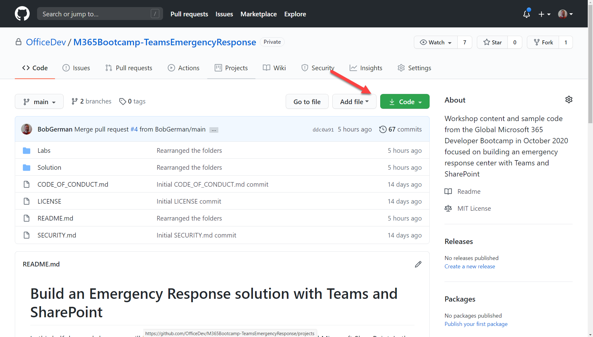
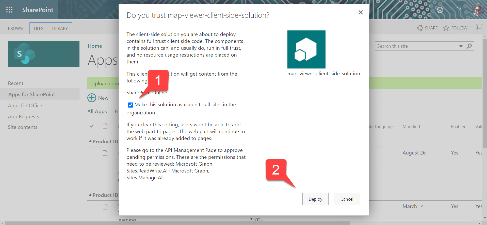
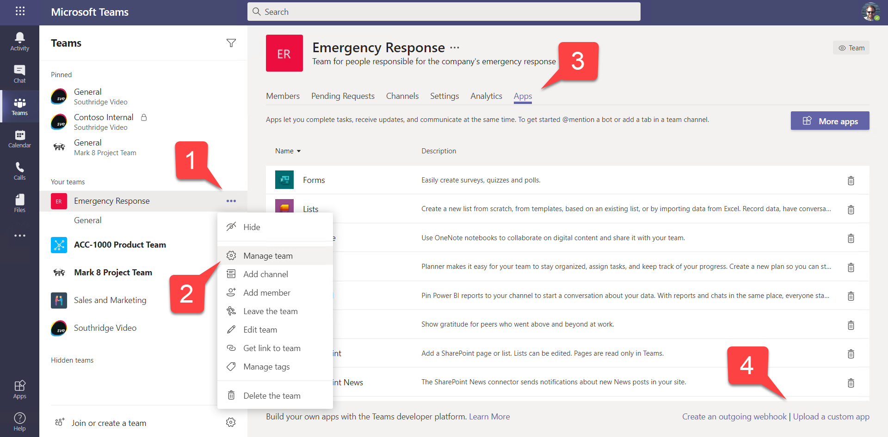
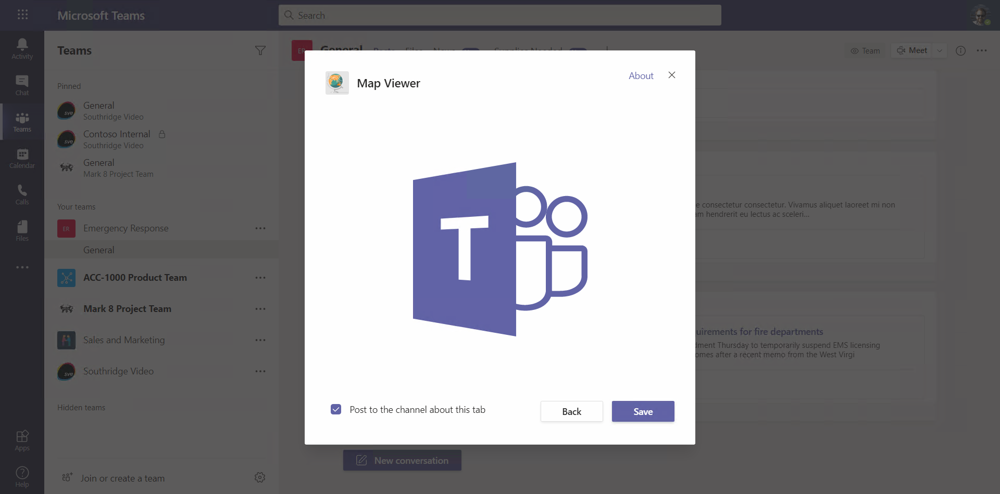
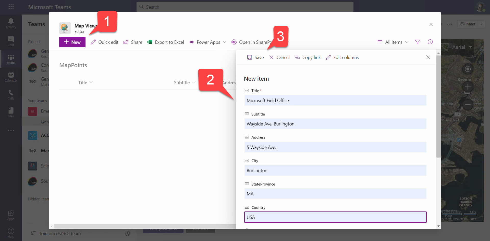
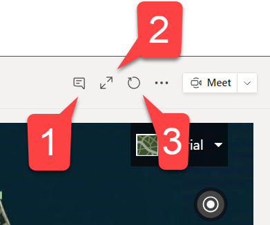
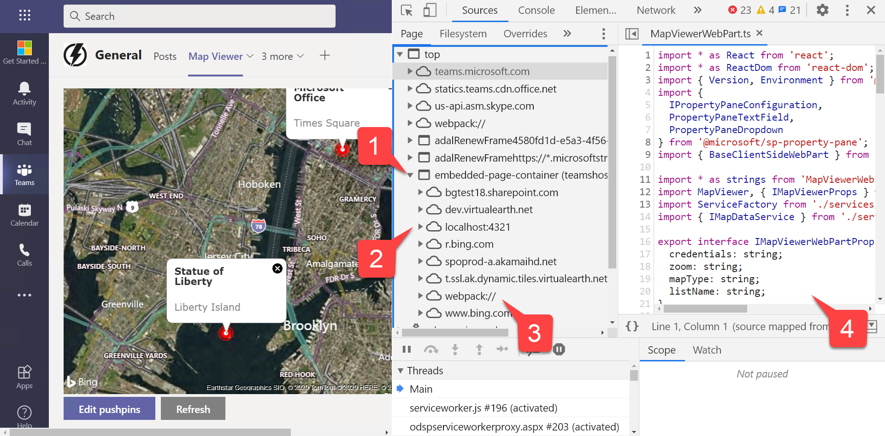

# Part 4: SharePoint Framework tabs

 * [Exercise 1: Lab setup](Part1.md)
 * [Exercise 2: SharePoint News](Part2.md)
 * [Exercise 3: SharePoint List Tab](Part3.md)
 * [Exercise 4: SharePoint Framework tabs](Part4.md) **(You are here)**
 * [Exercise 5: Calling the Microsoft Graph](Part5.md)
 * [Resources](Resources.md)

In this exercise, you will build a map tab that can display trouble spots during an emergency. Tha tab is built as a SharePoint Framework web part, where Sharepoint provides hosting, authentication, and a number of other services. As in Exercise 3, the data is stored in a SharePoint list, but this time the list is accessed using the Microsoft 365 Graph.

## Before you begin

To complete all the steps in this exercise and the next you will need:

 * A computer running a code editor such as Visual Studio Code
 * A computer running [Node.js](https://nodejs.org/en/) [version 10.x.](https://nodejs.org/download/release/latest-dubnium/) to run the development toolchain. (SharePoint Framework only works with Node.js 10.x)

**If this is impractical for some reason, the completed builds are provided as part of this repository. The instructions include details on how to install the pre-built packages.**

While SharePoint Framework for SharePoint Online only supports Node.js version 10.x, you may find yourself wanting other versions for other projects. To facilitate swtiching Node versions on your computer, you may wish to install [Node Version Manager (nvm)](http://npm.github.io/installation-setup-docs/installing/using-a-node-version-manager.html) before installing Node.js. Then you can these commands to install and swap Node versions: 

~~~bash
nvm install (version) # Install a Node version, such as 10.22.1)
nvm list              # List the installed versions
nvm use (version)     # Switch to the specified Node version
~~~

Once you've installed a supported version of Node, installing the rest of the SharePoint Framework toolchain is easy. You can follow [these detailed instructions](https://docs.microsoft.com/en-us/sharepoint/dev/spfx/set-up-your-development-environment), or run just these Node commands:

~~~bash
npm install gulp yo @microsoft/generator-sharepoint --global
gulp trust-dev-cert
~~~

---
⛏️ SHAREPOINT FRAMEWORK REQUIRES HTTPS. The `gulp trust-dev-cert` command adds the SharePoint Framework's local SSL certificate to your certificate store so you can test your solutions with the JavaScript bundle running locally.

---

## Step 1: Download and build the project

a. Clone or download the bootcamp repository by returing to the [project page](../) and clicking the Code button. 

b. To view the source code, open the [project folder (Solution/MapViewer)](../Solution/MapViewer/) in your code editor. If you don't have a code editor, you can [view it in the browser here](../Solution/MapViewer). You don't need to change the code, however, until the next exercise.

c. If you don't have developer tools installed, you can find the finished solution package in the [Solution/MapViewerPackages/Exercise 4](../Solution/MapViewerPackages/Exercise%204) folder. Download the map-viewer.sppkg file and skip to Step 2.

If you do have developer tools installed, open a command line program and and browse to the MapViewer folder. 

Install the needed Node.js packages using this command:

~~~bash
npm install
~~~

OPTION 1: If you want to run from a local web server so you don't have to upload your changes each time you make a change, run these commands:

~~~bash
gulp bundle
gulp package-solution
gulp serve --nobrowser
~~~

That last command starts a local web server at https://localhost:4321; and the SharePoint package points to that URL instead of a CDN so be sure leave it running.

OPTION 2: If you want to upload your JavaScript bundle to the SharePoint public CDN so it will work away from your development computer, run these commands:

~~~bash
gulp bundle --ship
gulp package-solution --ship
~~~

In either case, your bundle can be found in the MapVewer/sharepoint folder with the name `map-viewer.sppkg`.

## Step 2: Upload the SharePoint solution package to the SharePoint App Catalog

a. Return to the SharePoint app catalog. You can review [Exercise 1 Step 3](Part1.md) if you need a reminder on how to get there.

Within the App Catalog, navigate to "Apps for SharePoint".

b. Upload the SharePoint solution package (.sppkg file) from Step 1. A dialog box will open up. Ensure that the "Make this solution available in all sites" checkbox 1️⃣ is checked, anbd then click the "Deploy" button 2️⃣. This allows it to be used in any Team's associated SharePoint site.

c. Find the map-viewer solution and scroll all the way to the right. Ensure there were no errors.

NOTE: If you encounter errors, it may be because your SharePoint app catalog hasn't finished installing itself. It can take up to 30 minutes.

## Step 3: Approve permissions

a. Return to the SharePoint administration page, open the "Advanced" accordian 1️⃣, and click "API access" 2️⃣. In a moment you should see new permissions being requested; these permissions are the ones required for the Microsoft Graph calls used to provision, read, and write a list in SharePoint.

Select one of the permission requests 3️⃣ and then click the "Approve" button 4️⃣. Repeat this with the other permission request.

b. Ensure the permissions have been approved as shown.

## Step 4: Install the app in the Emergency Response Team

a. Return to Microsoft Teams. Click the elipsis to the right of your Emergency Response Team name (not the channel) 1️⃣ and select "Manage Team" from the menu 2️⃣. Select the "Apps" tab 3️⃣. 

In the lower right corner of the screen, click "Upload a custom app" 4️⃣. Navigate to your local copy of this repository; in the [Solution/MapView/Teams](../Solution/MapView/Teams/) folder, you will find a Teams solution package `MapViewer.zip`. This is the file you need to upload.

b. The app summary page will come up; just click "Add".

c. Next the tab confirugration page will come up; click "Save".

---
⛏️ WHY AN EMPTY PAGE WITH A BIG TEAMS LOGO? In Teams channels and group conversations, tabs are _configurable_. This means the app provides a configuration page where the user can decide what the tab should show. In this case, SharePoint didn't need any additional information, so they just showed the Teams logo. This allows your SharePoint Framework web part to use the standard web part editing experience, which you'll see in just a moment.

---

d. The tab will open but initially the map won't work because it requires a Bing Maps key. You can get a free Bing Maps key at the [Bing Maps Get Started](https://www.microsoft.com/en-us/maps/create-a-bing-maps-key) page. If you are taking a live workshop, your instructor may be able to provide you with a temporary Bing Maps key.

Enter the Bing Maps key into the property panel 1️⃣ and decide if you want an aerial or road map 2️⃣. The web part will create a list to store the points on the map; you can choose a different list name if you wish 3️⃣. When you're done click "Apply" 4️⃣.

Don't forget to close the configuration panel.

---
⛏️ THE CONFIGURATION PANEL on the right is the normal web part property pane used by any web part. By using the same method in Teams, it's easier for developers to build solutions that work in both SharePoint sites and Teams tabs.

---

e. Click the "Edit points" button to add some points to the map. This will open the SharePoint list in a Teams Task Module, which is just an IFrame disguised as a modal dialog box. Using the list user interface saves writing code to manage the points on the map.

Create each new point by clicking the New button 1️⃣. Enter a title and subtitle to be displayed, as well as the street address of the location you want to highlight 2️⃣. Often you can enter the name of an attraction in place of an address.

Enter a few points that aren't too far apart and close the task module.

---
⛏️ The trick here is to avoid writing all the code to create, read, update, and delete map points but instead just show the SharePoint list in a [task module](https://docs.microsoft.com/microsoftteams/platform/task-modules-and-cards/what-are-task-modules?WT.mc_id=M365-github-rogerman). Task modules are IFrames showing a web page in the form of a modal dialog box. You can view the code in [MessagePanel.tsx](../Solution/MapViewer/src/webparts/mapViewer/components/MessagePanel.tsx) in the `LaunchEditor()` function. Notice that when the task module is closed the display is refreshed to update the points on the map.

---
⛏️ Geocoding is done in [BingMapsService.ts](../Solution/MapViewer/src/webparts/mapViewer/services/BingMapsService/BingMapsService.ts). Since this will call the Bing Maps web service, it was necessary to add an entry for the hostname to the `validDomains` array in the [Teams manifest](../Solution/MapViewer/src/webparts/mapViewer/Teams/manifest.json); otherwise Teams will block the access. Wildcards are permitted, so the entry is `*.virtualearth.net` to allow any host name within that DNS domain.

---

A message below the map should show "Updating" as the tab geo-codes the map points and writes them back to the list. When this is done, the points should appear on the map.

If they don't appear, press the "Edit points" button again and make sure they were all geo-coded (latitude and longitude should be filled in). If not, you may need to change the way you enter the address.

Another thing that could cause the points to not show up is if the map is zoomed in too far. The map will always center itself at the middle of a rectangle defined by the two most distant points; if they're too far apart, they may be off the map. To fix this, click the drop-down on the Map View tab 1️⃣ and then "Settings" 2️⃣ to re-open the configuration panel. Change the zoom level 3️⃣ and click "Apply" 4️⃣. Repeat until you find a zoom level that works well; then close the editing panel 5️⃣.

## Step 5: Try out the tab buttons

Notice the buttons just above your tab (and every tab) on the right.

1️⃣ opens a conversation panel so you can chat about the tab. The chat shows up in the channel's Posts as well, drawing people into the conversation.

2️⃣ expands the tab so it gets more space on the screen.

3️⃣ refreshes just the tab; this is very handy when you're debugging!

## Step 6: Debug your tab

If you've set up the SharePoint Framework development environment and are serving the project files up from localhost, you also have the advantage of a map file for debugging. This file unscrambles the JavaScript bundle and reconstructs the orginal Typescript source for your debugging pleasure.

You might choose to [attach Visual Studio code to your browser](https://code.visualstudio.com/blogs/2016/02/23/introducing-chrome-debugger-for-vs-code?WT.mc_id=M365-github-rogerman) to debug, but you can also just open up the browser's developer tools. 

a. Open your browser's developer tools; for Chrome and the new Chromium-based Microsoft Edge, you can do that by pressing ctrl (or option) + shift + I. Examine the page hierarchy; notice the embedded-page-container 1️⃣ ; that's the IFrame your tab is running in.  Inside the IFrame, you can see localhost:4321 2️⃣, which is where SharePoint is getting the JavaScript bundle for your solution. But if you look there, you'll find the raw JavaScript bundle, which is hard to read. What we want is under the webpack:// node 3️⃣, which is where the map file has been used to reconstruct the original TypeScript source. However, there's no need to go digging; just click ctrl (or option) + P and type the name of a source file such as MapViewerWebPart.ts to expose the source code.

---
⛏️ Your tab is hosted in a special SharePoint page, `/_layouts/15/teamshostedapp.aspx`, in the site associated with this Team. Personal tabs implemented as web parts are shown in the root SharePoint site under that URL, which is one reason to make the root site readable by everyone in an organization.

---
 
b. Try setting a breakpoint in, say, the onInit() function. Refresh the just the tab using the refresh button you tried in the last step, and hit the breakpoint.

When you're ready, please [proceed to the next section.](Part5.md)